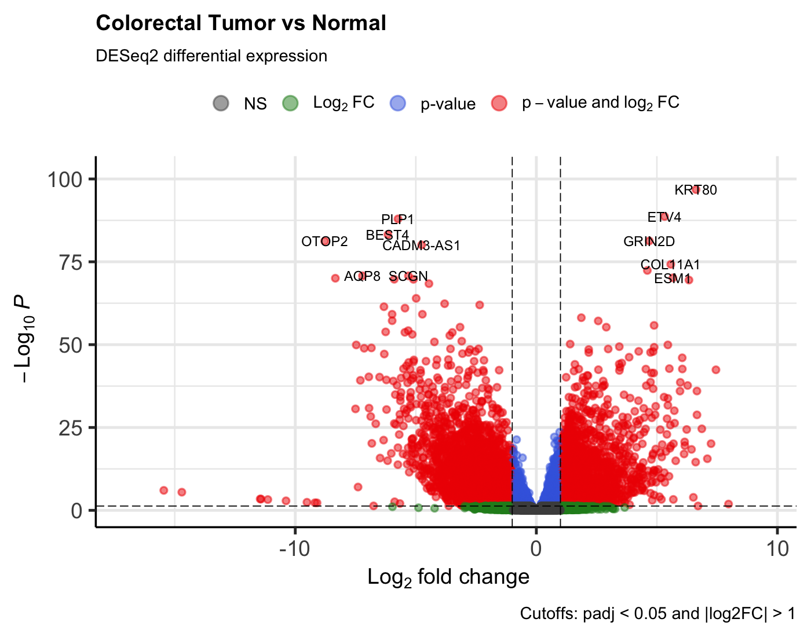
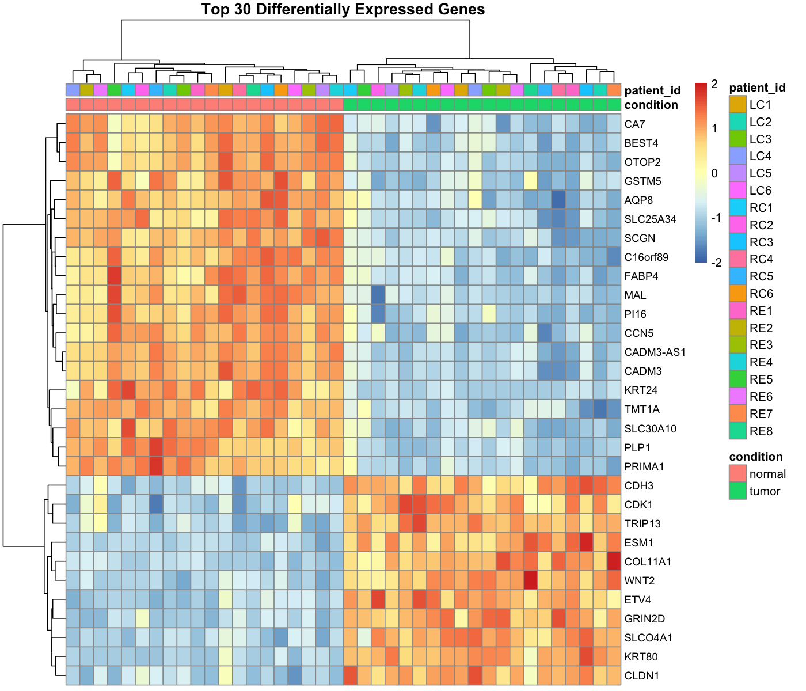

# Matched Tumor-vs-Normal Differential Expression in Colorectal Cancer Using DESeq2

## Project Overview
This project analyzes public bulk RNA-seq data from colorectal cancer samples to compare tumor tissue with matched adjacent normal tissue. The goal was to build a reproducible bioinformatics workflow in R, prepare clean count and metadata files, run differential expression analysis with DESeq2, and visualize the results.

## Dataset
- **Source:** NCBI GEO
- **Accession:** GSE142279
- **Organism:** Homo sapiens
- **Study design:** 20 matched pairs of colorectal tumor and adjacent normal tissue
- **Total samples:** 40

## Tools Used
- R
- DESeq2
- AnnotationDbi
- org.Hs.eg.db
- EnhancedVolcano
- pheatmap
- VS Code
- GitHub

## Workflow
1. Downloaded public RNA-seq raw counts and annotation data from GEO
2. Created a clean metadata table linking GSM accession IDs to sample labels and matched patient IDs
3. Built count matrices and sample information tables for DESeq2
4. Created a paired DESeq2 dataset using the design: `~ patient_id + condition`
5. Filtered low-count genes
6. Ran differential expression analysis comparing tumor vs normal tissue
7. Added human gene symbols to the results
8. Created a volcano plot and heatmap of top differentially expressed genes

## Key Results
- **Genes retained after filtering:** 31,516
- **Total significant genes (padj < 0.05):** 13,043
- The analysis showed strong transcriptional differences between tumor and normal tissue.
- The volcano plot highlighted many genes with large fold changes and strong statistical significance.
- The heatmap of the top 30 genes showed clear separation between tumor and normal samples.

## Output Files
### Results
- `results/deseq2_full_results.csv`
- `results/deseq2_significant_genes.csv`
- `results/top20_genes_by_padj.csv`
- `results/deseq2_full_results_with_symbols.csv`
- `results/top20_genes_with_symbols.csv`

### Figures
- `figures/volcano_plot.png`
- `figures/top30_heatmap.png`

## Example Figures

### Volcano Plot

### Top 30 Heatmap

## Project Skills Demonstrated
- RNA-seq data handling
- sample metadata organization
- count matrix preparation
- differential expression analysis
- paired experimental design
- gene annotation
- bioinformatics visualization
- reproducible project structure

## Resume Description
Built a bulk RNA-seq bioinformatics workflow in R using public colorectal cancer data, prepared matched tumor-normal metadata and count matrices, ran paired DESeq2 differential expression analysis, and visualized significant results with a volcano plot and heatmap.